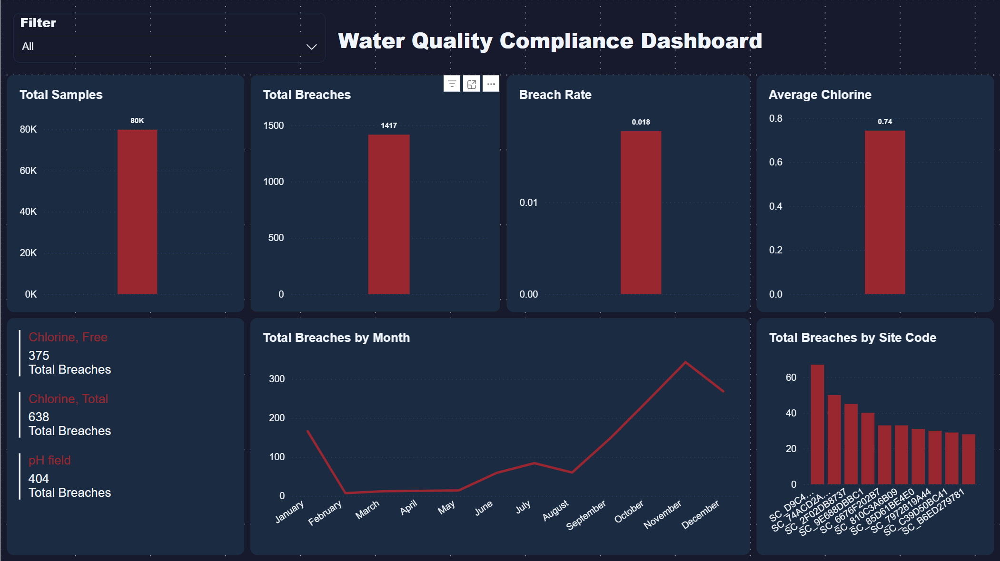

# Water Quality Compliance Dashboard (Power BI)

---
## Overview
This project analyzes operational water quality sampling data using Power BI to monitor regulatory compliance, identify high-risk sites, and track breach trends over time.

The dashboard provides a clear operational view of chlorine levels, pH compliance, and breach hotspots across the network. It simulates a real-world utility operations dashboard used by water quality and compliance teams.

---

## Dataset Summary

- Total samples: **79,862**
- Total compliance breaches: **1,417**
- Overall breach rate: **1.77%**
- Parameters monitored:
  - Chlorine, Free — 21,653 samples
  - Chlorine, Total — 21,654 samples
  - Temperature — 21,654 samples
  - pH field — 14,901 samples
- Average Free Chlorine level: **0.74 mg/L**

Fields included:

- Result Date
- Parameter
- Result value
- Limit Breached indicator
- Site Code
- Zone
- Sample Point

Sensitive identifiers were anonymized for portfolio use.

---

## Business Problem

Water utilities must continuously monitor water quality to ensure regulatory compliance and safe drinking water. With nearly 80,000 measurements collected, it is difficult to manually:

- Identify sites with repeated compliance breaches
- Monitor chlorine levels across the network
- Detect compliance trends over time
- Prioritize operational maintenance and investigation

This dashboard provides a centralized compliance monitoring tool.

---

## Tools Used

- Power BI Desktop
- Power Query (data cleaning and transformation)
- DAX (calculated measures and KPIs)

Key DAX measures created:

- Total Samples  
- Total Breaches  
- Breach %  
- Average Chlorine  
- Breaches by Site  
- Breaches by Parameter  
- Breaches by Month  

---

## Dashboard Features

### KPI Monitoring
High-level system performance indicators:

- **79,862 total samples**
- **1,417 total breaches**
- **1.77% breach rate**
- **0.74 mg/L average free chlorine**

---

### Compliance by Parameter

Breaches are concentrated in chlorine and pH measurements:

- Chlorine, Total — 638 breaches
- pH field — 404 breaches
- Chlorine, Free — 375 breaches

These parameters represent the primary compliance risk areas.

---

### Trend Analysis

Monthly breach trends show:

- Low breach counts early in the year
- Increasing breach frequency from mid-year onward
- Peak breach activity in November
- Slight decline in December

This suggests potential seasonal or operational influences.

---

### Site Risk Identification

The dashboard highlights sites with the highest breach counts.

Key finding:

A small number of sites account for a disproportionate number of compliance breaches, allowing targeted operational investigation.

---

## Dashboard Screenshot

---

## Project Structure

water-quality-powerbi/  
│  
├ data/  
│ water_quality_raw.csv  
│   
├ powerbi/  
│ water_quality_dashboard.pbix  
│   
├ screenshots/  
│ dashboard.png  
│   
└ README.md  

---

## Skills Demonstrated

Power BI dashboard development  
Data cleaning and transformation  
DAX measure creation  
Operational data analysis  
Compliance monitoring analytics  
Data visualization and storytelling  

---

## How to Use

1. Open the `.pbix` file in Power BI Desktop  
2. Update the data source if required  
3. Click Refresh  
4. Use filters to explore zones, sites, and parameters  

---

## Author

Luke Papaevangeliou  
Data Analyst Portfolio Project